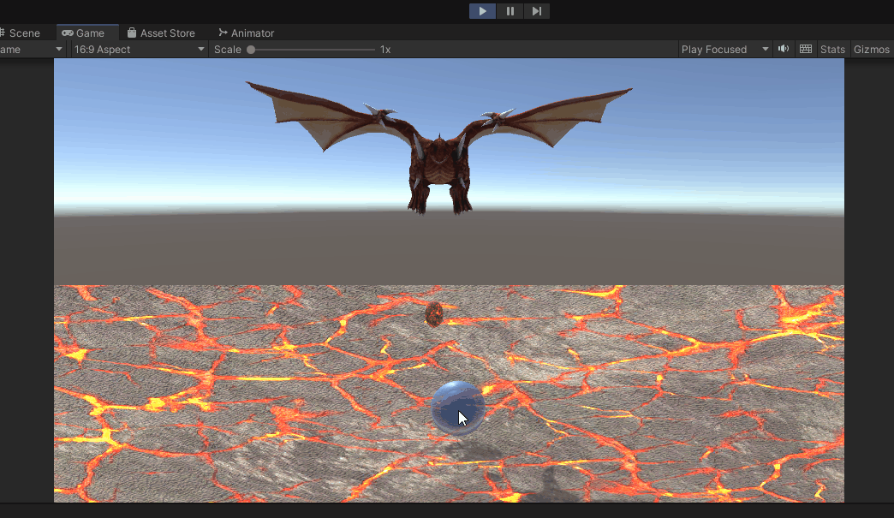
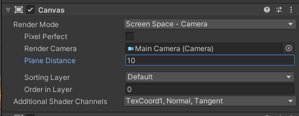
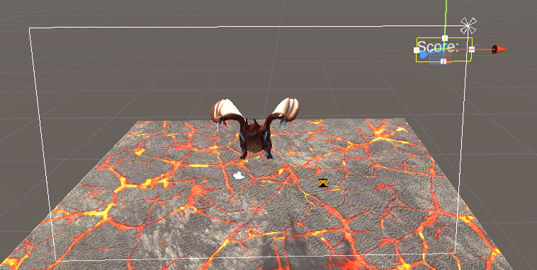
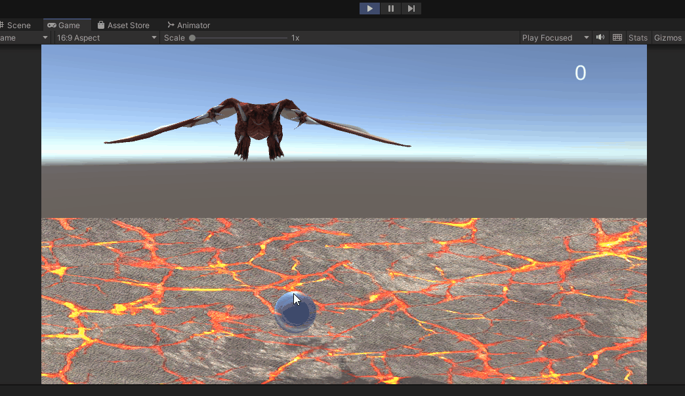
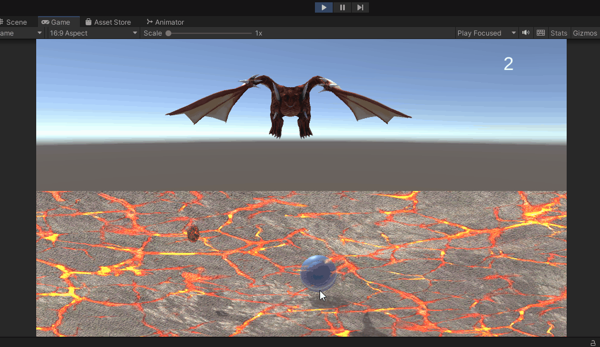
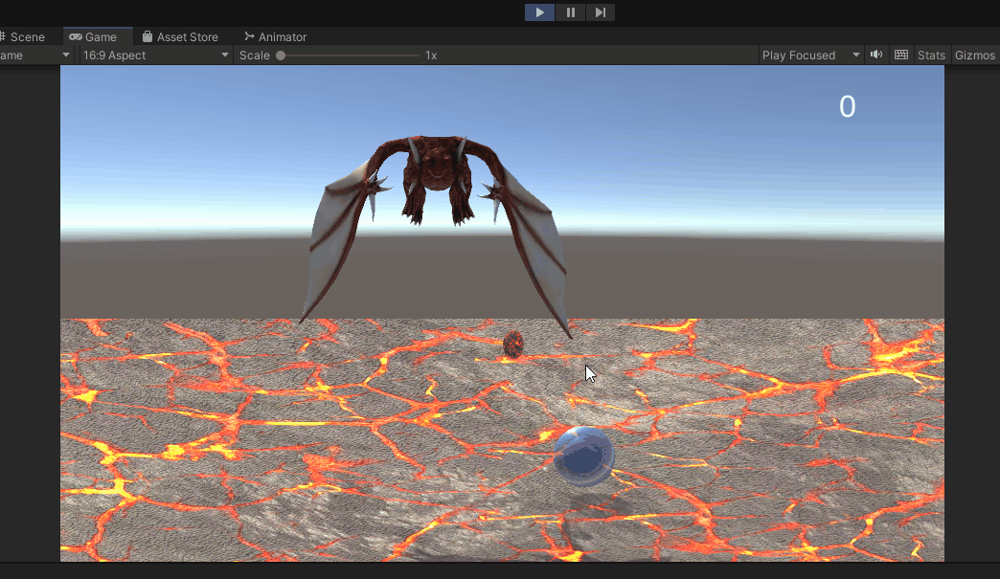
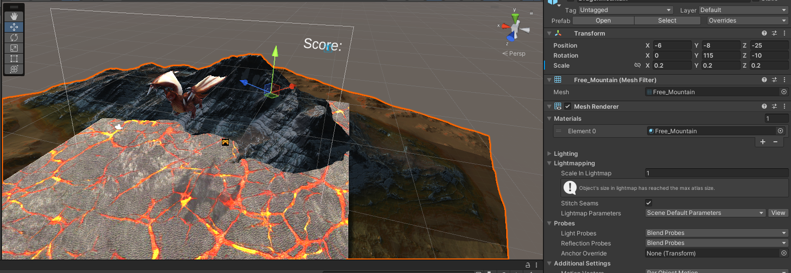
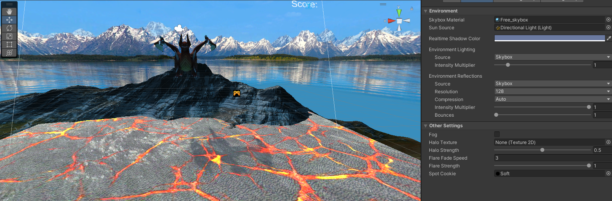
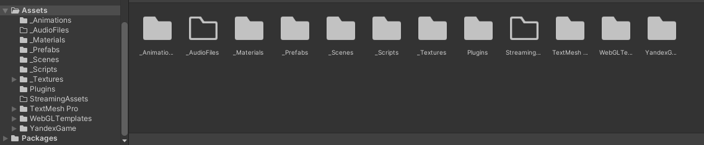
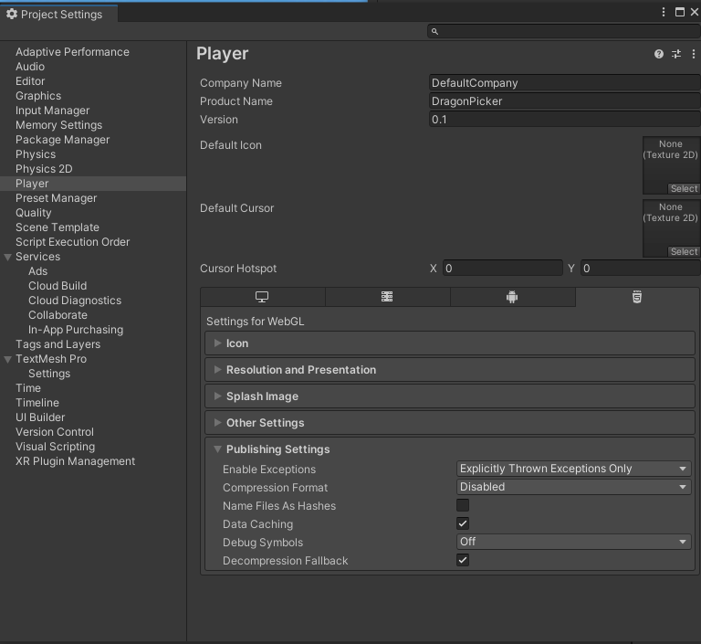

# РАЗРАБОТКА ИГРОВЫХ СЕРВИСОВ
Отчет по лабораторной работе #3 выполнил:
- Абзапаров Николай Дмитриевич
- РИ300012
### Ссылка на репозиторий с проектом: https://github.com/Abzaparov-Nikolay/DragonPicker

Отметка о выполнении заданий (заполняется студентом):

| Задание | Выполнение | Баллы |
| ------ | ------ | ------ |
| Задание 1 | * | 60 |
| Задание 2 | * | 20 |
| Задание 3 | * | 20 |

знак "*" - задание выполнено; знак "#" - задание не выполнено;

Работу проверили:
- к.т.н., доцент Денисов Д.В.
- к.э.н., доцент Панов М.А.
- ст. преп., Фадеев В.О.

## Цель работы
Интеграция интерфейса пользователя в разрабатываемое интерактивное приложение.

## Задание 1
1) Реализовал следование щита за мышкой 

2) Реализовал удаление яйца при соприкосновении с щитом
   
3) Создал канвас и сделал необходимые настройки
   
4) Создал элемент для вывода очков на экран
   
5) Сделал подсчет очков за каждое пойманное яйцо
   
6) Сделал так, что при взрыве яйца все другие яйца пропадают со сцены
   
## Задание 2

1) Реализовал уничтожение щитов при взрыве яиц
   
2)  Добавил в accet store и заимпортил в свой проект autumn mountain package, после этого добавил гору на сцену
   
3)  Добавил Skybox с горами на фоне на сцену
   
4)  Провел структурирование исходных файлов в папке проекта
   
   ## Задание 3

1) Отключил комперессию в настройках билда на странице Player
   
2) При выполнении прошлой лабораторной работы выполнил подключение PluginYG package
3)  Собрал WebGL билд под Яндекс Игры
4)  Загрузил архив со сборкой в исходники черновика на Яндекс Играх
   
5)  Игру можно найти по ссылке: https://yandex.ru/games/app/198458?draft=true&lang=ru

# Выводы
Узнал, как интегрировать игровые сервисы в свой юнити проект, как публиковать свой проект на Яндекс.Играх и как структурировать файлы в проекте
## Powered by

**BigDigital Team: Denisov | Fadeev | Panov**
